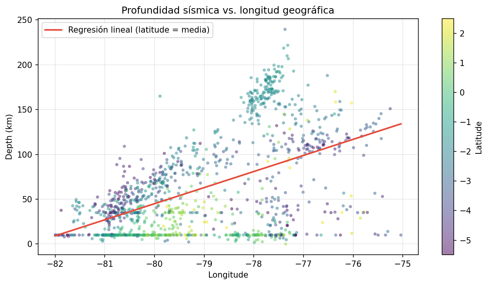
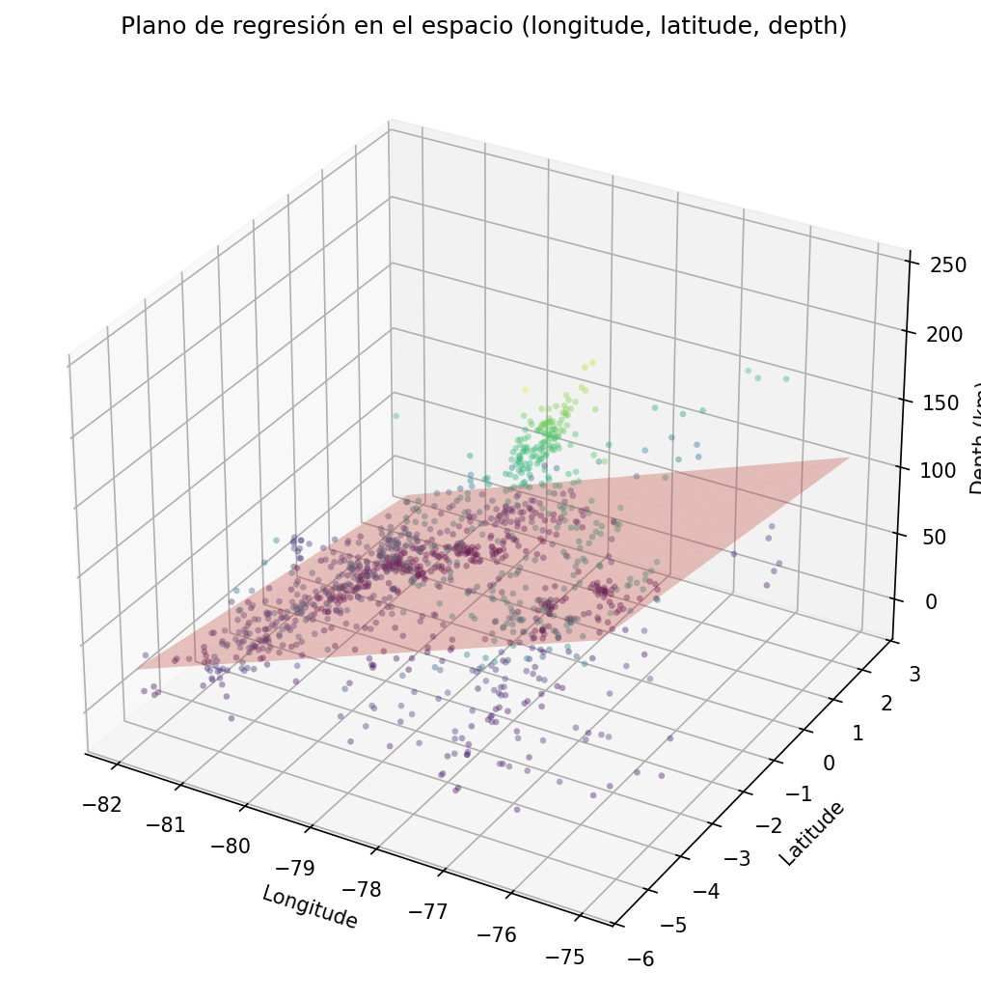
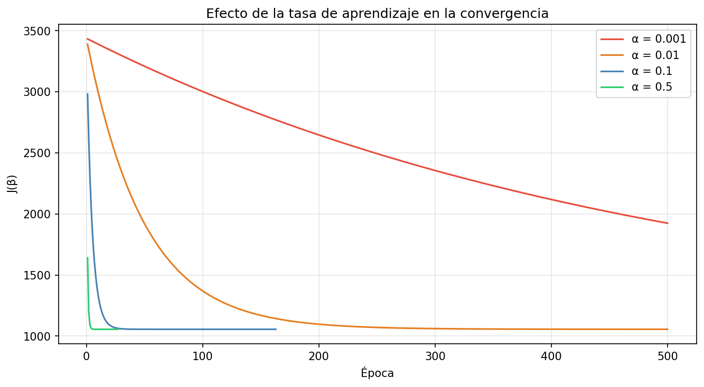

# Regresión Lineal desde Cero con NumPy — Sismos de Ecuador

> Implementación completa de regresión lineal sin Scikit-learn: derivación matemática rigurosa de la función de costo, demostración de existencia y unicidad del mínimo, implementación de solución analítica y gradient descent, y verificación contra Scikit-learn con diferencia del orden de $10^{-13}$.

[](https://colab.research.google.com/github/Eduardo0602/regresion-lineal-numpy-desde-cero/blob/main/notebooks/01_exploracion_datos_sismicos.ipynb)

---

## Descripción

Este proyecto implementa regresión lineal múltiple desde cero utilizando únicamente NumPy, sobre datos sísmicos de Ecuador obtenidos del catálogo del USGS. El objetivo es predecir la profundidad del hipocentro (depth) a partir de la posición geográfica (longitude y latitude), aprovechando la geometría de la zona de subducción de Wadati-Benioff donde la placa de Nazca se hunde bajo la Sudamericana.

Lo que distingue este proyecto de una implementación convencional es el tratamiento matemático: cada fórmula se deriva paso a paso, las identidades del cálculo matricial se demuestran explícitamente, y la existencia y unicidad del mínimo se prueban formalmente usando el Teorema de Weierstrass (con coercividad) y convexidad estricta (via la Hessiana definida positiva).

El proyecto se estructura en dos notebooks: exploración y selección de features, seguido de la implementación y verificación del modelo.

---

## Dataset

| Característica | Detalle |
|---|---|
| **Fuente** | [USGS Earthquake Hazards Program — FDSNWS Event Web Service](https://earthquake.usgs.gov/fdsnws/event/1/) |
| **Consulta** | Sismos en Ecuador, 2010–2025, magnitud ≥ 2 |
| **Dimensiones originales** | 1187 filas × 22 columnas |
| **Dimensiones procesadas** | 1187 filas × 3 columnas (longitude, latitude, depth) |
| **Variable objetivo** | `depth` — profundidad del hipocentro en km |
| **Features seleccionadas** | `longitude` (Pearson 0.521) y `latitude` (Pearson −0.207) |
| **Features descartadas** | `mag` descartada por correlación prácticamente nula con depth |

---

## Obtener los Datos

El dataset se descarga directamente desde la API del USGS. Para replicar la consulta exacta:

1. Ir a [USGS Earthquake Catalog Search](https://earthquake.usgs.gov/earthquakes/search/)
2. Configurar los parámetros:
   - **Date Range:** 2010-01-01 a 2025-12-31
   - **Magnitude:** mínimo 2
   - **Geographic Region:** Custom Rectangle
     - North: 2.5, South: -6, West: -82.5, East: -74.5
   - **Output Format:** CSV
3. Descargar y colocar el archivo en `data/raw/`

Alternativamente, usar directamente la URL de la API:

```
https://earthquake.usgs.gov/fdsnws/event/1/query?format=csv&starttime=2010-01-01&endtime=2025-12-31&minmagnitude=2&minlatitude=-6&maxlatitude=2.5&minlongitude=-82.5&maxlongitude=-74.5
```

---

## Fundamento Matemático

El modelo minimiza la función de costo de mínimos cuadrados:

$$J(\boldsymbol{\beta}) = \frac{1}{2m}\|X\boldsymbol{\beta} - \mathbf{y}\|^2$$

donde $X \in \mathbb{R}^{1187 \times 3}$ es la matriz de diseño (con columna de unos para el intercepto) y $\boldsymbol{\beta} \in \mathbb{R}^3$.

**Existencia y unicidad del mínimo.** Se demostró que $J$ es continua y coerciva (via descomposición espectral de $X^\top X$ y cota inferior con $\lambda_{\min}$), lo que por el Teorema de Weierstrass garantiza la existencia del mínimo. La unicidad se establece probando que la Hessiana $H_J = \frac{1}{m}X^\top X$ es definida positiva (bajo independencia lineal de columnas de $X$), lo que implica convexidad estricta — y una función estrictamente convexa tiene a lo sumo un mínimo.

**Dos vías de solución:**

- **Solución analítica (ecuaciones normales):** resolviendo $X^\top X\,\boldsymbol{\beta} = X^\top \mathbf{y}$ con `np.linalg.solve` (no `np.linalg.inv`, por estabilidad numérica y eficiencia).
- **Gradient descent:** ecuación de recurrencia $\boldsymbol{\beta}_{t+1} = \boldsymbol{\beta}_t - \frac{\alpha}{m}X^\top(X\boldsymbol{\beta}_t - \mathbf{y})$, derivada desde la aproximación de Taylor de primer orden y la desigualdad de Cauchy-Schwarz.

---

## Resultados Principales

- **Verificación contra Scikit-learn exitosa:** la solución analítica difiere de `LinearRegression` de sklearn en $2.84 \times 10^{-13}$ (diferencia máxima entre coeficientes). Gradient descent converge a $2.48 \times 10^{-4}$ del óptimo en 118 épocas con $\alpha = 0.1$.
- **Coeficientes del modelo (espacio normalizado):** $\beta_0 = 62.149$ km (intercepto), $\beta_1 = 27.921$ km/σ (longitude), $\beta_2 = -9.347$ km/σ (latitude).
- **$\beta_1 > 0$ confirma la geometría de Wadati-Benioff:** al moverse hacia el este (hacia el interior del continente), la profundidad del hipocentro aumenta — la placa de Nazca se hunde progresivamente bajo la Sudamericana.
- **Ajuste limitado:** $R^2 = 0.3000$, RMSE $= 45.94$ km, MAE $= 34.61$ km. La distribución bimodal de depth (sismos corticales 0–30 km y de subducción 100–200 km) no es capturada por un único plano lineal.
- **Condicionamiento numérico verificado:** $X^\top X$ tiene valores propios $\lambda_0 = 1101.70$, $\lambda_1 = 1187.00$, $\lambda_2 = 1272.30$ y número de condición $= 1.15$, confirmando la hipótesis de independencia lineal.







---

## Notebooks

| # | Notebook | Descripción |
|---|---|---|
| 01 | [`01_exploracion_datos_sismicos.ipynb`](notebooks/01_exploracion_datos_sismicos.ipynb) | Exploración del dataset: distribución de depth (bimodal), análisis de correlación Pearson vs. Spearman, selección de features, corte transversal de Wadati-Benioff, exportación de `sismos_clean.csv`. |
| 02 | [`02_regresion_lineal.ipynb`](notebooks/02_regresion_lineal.ipynb) | Fundamento matemático completo (función de costo, gradiente con identidades demostradas, existencia y unicidad del mínimo). Implementación de clase `RegresionLineal` con solución analítica y gradient descent. Verificación contra sklearn. Análisis del efecto de $\alpha$ e interpretación geofísica. |

---

## Estructura del Proyecto

```
regresion-lineal-numpy-desde-cero/
├── data/
│   ├── raw/                        # Dataset original del USGS (no incluido)
│   └── processed/                  # sismos_clean.csv (1187 × 3)
├── notebooks/
│   ├── 01_exploracion_datos_sismicos.ipynb
│   └── 02_regresion_lineal.ipynb
├── reports/
│   └── figures/                    # 9 visualizaciones exportadas
├── src/                            # Reservado para proyectos futuros
├── README.md
├── requirements.txt
└── .gitignore
```

---

## Tecnologías


- **Lenguaje:** Python 3.11
- **Implementación numérica:** NumPy (implementación desde cero)
- **Manipulación de datos:** Pandas
- **Visualización:** Matplotlib
- **Verificación:** Scikit-learn (solo para comparación de coeficientes)
- **Entorno:** Conda (`ds_portafolio`) + JupyterLab
- **Control de versiones:** Git + GitHub

---

## Cómo Reproducir

```bash
# 1. Clonar el repositorio
git clone https://github.com/Eduardo0602/regresion-lineal-numpy-desde-cero.git
cd regresion-lineal-numpy-desde-cero

# 2. Crear el entorno con Conda
conda create -n ds_portafolio python=3.11 -y
conda activate ds_portafolio
pip install -r requirements.txt

# 3. Descargar el dataset original del USGS
#    Opción A: Ir a https://earthquake.usgs.gov/earthquakes/search/
#              y configurar la consulta (ver sección "Obtener los Datos")
#    Opción B: Descargar directamente desde la API:
#    https://earthquake.usgs.gov/fdsnws/event/1/query?format=csv&starttime=2010-01-01&endtime=2025-12-31&minmagnitude=2&minlatitude=-6&maxlatitude=2.5&minlongitude=-82.5&maxlongitude=-74.5
#    Colocar el archivo CSV en data/raw/

# 4. Ejecutar los notebooks en orden
jupyter lab
#    Abrir 01 → 02 y ejecutar Kernel → Restart & Run All en cada uno
```

---

## Lo que Aprendí

1. **Demostrar, no declarar.** Un modelo no "tiene" un mínimo único porque lo dice un libro — se demuestra construyendo la cadena de hipótesis: continuidad + coercividad → existencia (Weierstrass), Hessiana definida positiva → convexidad estricta → unicidad. Cada paso depende del anterior.

2. **La implementación numérica no es la fórmula escrita en otro lenguaje.** La fórmula dice $(X^\top X)^{-1}X^\top \mathbf{y}$, pero calcular la inversa es innecesario y numéricamente inferior a resolver el sistema lineal directamente. La distancia entre la matemática en papel y el código que la ejecuta bien es donde está el oficio.

3. **Normalizar no es opcional para gradient descent.** Con features en escalas distintas (longitude $\sim [-82, -75]$ vs. latitude $\sim [-5, 2]$), las curvas de nivel de $J$ se deforman y el descenso oscila. La estandarización z-score fue la diferencia entre convergencia en 118 épocas y no convergencia práctica en 500.

4. **Un $R^2$ bajo no invalida un proyecto.** El modelo lineal explica solo el 30% de la varianza, pero ese resultado es informativo: revela una estructura bimodal en los datos que un solo plano no puede capturar. El valor del proyecto está en la implementación rigurosa y verificada, no en la métrica de ajuste.

---

*Proyecto 0.3 del portafolio "De Matemático a Data Scientist" — Fase 0*