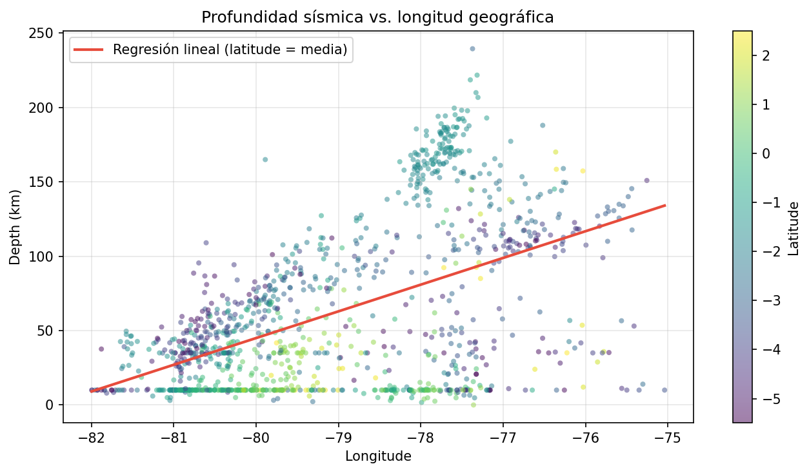
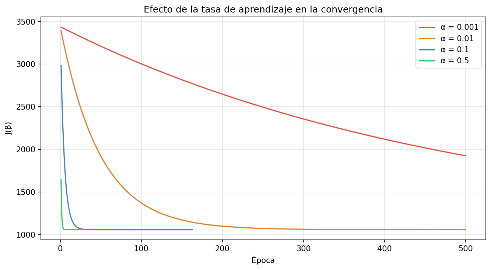

<p align="right"><b>English</b> · <a href="README.es.md">Español</a></p>

# Linear regression from scratch with NumPy: can a plane predict how deep Ecuador's earthquakes are?

Multiple linear regression without scikit-learn on 15 years of USGS earthquakes: derivation of the cost function, proof of existence and uniqueness of the minimizer, analytical solution, gradient descent and verification against scikit-learn.

     [](https://colab.research.google.com/github/Eduardo0602/regresion-lineal-numpy-desde-cero/blob/main/notebooks/01_exploracion_datos_sismicos.ipynb)

## The problem

In Ecuador the Nazca plate sinks beneath the South American plate (Wadati–Benioff zone): towards the east, earthquakes should be deeper. Is geographic position enough to predict hypocenter depth with a linear model? The project answers by implementing regression from scratch, with every formula derived and every identity proved.

## Data

| Feature | Detail |
|---|---|
| Source | [USGS Earthquake Hazards Program, FDSNWS Event Web Service](https://earthquake.usgs.gov/fdsnws/event/1/) |
| Query | Earthquakes in Ecuador, 2010–2025, magnitude ≥ 2 (box: N 2.5; S −6; W −82.5; E −74.5) |
| Dimensions | 1,187 rows × 22 columns (processed: 1,187 × 3) |
| Target | `depth`: hypocenter depth (km) |
| Selected features | `longitude` (Pearson 0.521) and `latitude` (Pearson −0.207); `mag` discarded for practically zero correlation |

The data are not included; they are downloaded with the API URL (see How to reproduce).

## Mathematical foundation

The model minimizes

```math
J(\boldsymbol{\beta}) = \frac{1}{2m}\|X\boldsymbol{\beta} - \mathbf{y}\|^2,
```

with $`X \in \mathbb{R}^{1187 \times 3}`$ (a column of ones for the intercept) and $`\boldsymbol{\beta} \in \mathbb{R}^3`$.

**Existence and uniqueness.** $`J`$ is continuous and coercive (by the spectral decomposition of $`X^\top X`$ and the bound with $`\lambda_{\min}`$), so Weierstrass' theorem guarantees a minimum. The Hessian $`H_J = \frac{1}{m}X^\top X`$ is positive definite if the columns of $`X`$ are linearly independent, which gives strict convexity and therefore uniqueness.

**Two ways to solve it.**
- Normal equations $`X^\top X\,\boldsymbol{\beta} = X^\top \mathbf{y}`$, solved with `np.linalg.solve` (not with `np.linalg.inv`, for stability and efficiency).
- Gradient descent, $`\boldsymbol{\beta}_{t+1} = \boldsymbol{\beta}_t - \frac{\alpha}{m}X^\top(X\boldsymbol{\beta}_t - \mathbf{y})`$, derived from the first-order Taylor approximation and the Cauchy–Schwarz inequality.

## Results

- **Coefficients (standardized features):** $`\beta_0 = 62.149`$ km, $`\beta_1 = 27.921`$ km per standard deviation of longitude, $`\beta_2 = -9.347`$ km per standard deviation of latitude.
- **$`\beta_1 > 0`$ confirms the Wadati–Benioff geometry:** depth increases towards the east.
- **Limited fit, reported as is:** $`R^2 = 0.3000`$, RMSE $`= 45.94`$ km, MAE $`= 34.61`$ km. Depth is bimodal (crustal earthquakes at 0–30 km and subduction ones at 100–200 km) and a single plane cannot capture it.
- **Well conditioned:** the eigenvalues of $`X^\top X`$ are 1101.70, 1187.00 and 1272.30, with condition number 1.15.





## Verification

The analytical solution differs from scikit-learn's `LinearRegression` by $`2.84 \times 10^{-13}`$ (maximum difference between coefficients). Gradient descent gets within $`2.48 \times 10^{-4}`$ of the optimum in 118 epochs with $`\alpha = 0.1`$.

## How to reproduce

```bash
git clone https://github.com/Eduardo0602/regresion-lineal-numpy-desde-cero.git
cd regresion-lineal-numpy-desde-cero
conda create -n ds_portafolio python=3.11 -y
conda activate ds_portafolio
pip install -r requirements.txt
# Download the USGS data and save it in data/raw/:
# https://earthquake.usgs.gov/fdsnws/event/1/query?format=csv&starttime=2010-01-01&endtime=2025-12-31&minmagnitude=2&minlatitude=-6&maxlatitude=2.5&minlongitude=-82.5&maxlongitude=-74.5
jupyter lab   # open 01 and 02 in order: Kernel → Restart & Run All
```

| Notebook | Contents |
|---|---|
| [`01_exploracion_datos_sismicos.ipynb`](notebooks/01_exploracion_datos_sismicos.ipynb) | Bimodal depth distribution, Pearson versus Spearman, feature selection, Wadati–Benioff cross-section |
| [`02_regresion_lineal.ipynb`](notebooks/02_regresion_lineal.ipynb) | Cost function, gradient with proved identities, existence and uniqueness; `RegresionLineal` class (analytical and gradient descent); verification against scikit-learn; effect of $`\alpha`$ |

Notebooks and code comments are in Spanish.

## Project structure

```
regresion-lineal-numpy-desde-cero/
├── data/processed/       # sismos_clean.csv (1187 × 3), generated by notebook 01
├── notebooks/            # 01 → 02
├── reports/figures/      # 9 figures
├── requirements.txt
└── LICENSE
```

## Limitations

- A linear model cannot capture the bimodal depth distribution; a model per seismic regime (crustal and subduction) or a nonlinear one would be the next step.
- Metrics are computed on the whole dataset: the goal was the implementation and its verification, not out-of-sample predictive power.

## What I learned

1. **Prove, do not declare.** The unique minimum does not exist because a book says so: the chain is built from continuity and coercivity, to existence, to a positive definite Hessian, to strict convexity, to uniqueness.
2. **Implementation is not the formula translated.** $`(X^\top X)^{-1}X^\top \mathbf{y}`$ is not computed by inverting the matrix: solving the system is more stable and efficient.
3. **Standardizing is not optional for gradient descent.** With different scales the level curves are distorted and descent oscillates; standardizing was the difference between converging in 118 epochs and not converging in 500.
4. **A low $`R^2`$ is also information.** 30 % of explained variance reveals a bimodal structure that a plane cannot capture.

---

### Portfolio *From Mathematician to Data Scientist*

| Project | Question | Tools |
|---|---|---|
| [Complex survey sampling with Ser Estudiante](https://github.com/Eduardo0602/muestreo-complejo-ser-estudiante) | How wrong is an analysis that ignores the sampling design? | R, survey |
| [Messy-data EDA: deaths 2021](https://github.com/Eduardo0602/eda-limpieza-defunciones-ecuador-pandas-sql) | What must be fixed before trusting an official registry? | Python, pandas, SQL |
| **Linear regression from scratch** (this repository) | Can a plane predict how deep Ecuador's earthquakes are? | Python, NumPy |
| [Visual linear algebra](https://github.com/Eduardo0602/algebra-lineal-visual-numpy) | What does a matrix do, geometrically? | Python, NumPy |

Eduardo Araque · Mathematician (Universidad Central del Ecuador) · [GitHub](https://github.com/Eduardo0602) · [LinkedIn](https://www.linkedin.com/in/eduardo-araque-jacome-math)
